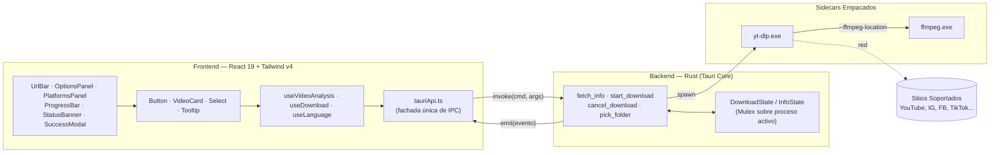

<div align="center">


# Mediagrab

**Pega un enlace. Elige tu formato. Listo.**

Descargador de audio y video de escritorio para Windows, construido sobre [`yt-dlp`](https://github.com/yt-dlp/yt-dlp) y `ffmpeg`, envuelto en una app nativa ultra-rápida con Tauri v2 y React 19.

[](https://tauri.app)
[](https://react.dev)
[](https://www.typescriptlang.org)
[](https://vitest.dev)
[](https://vitest.dev)
[](https://www.rust-lang.org)
[](https://tailwindcss.com)
[](https://prettier.io)
[](#soporte-bilingüe-i18n)

</div>

---

## Qué es

Mediagrab es una interfaz gráfica de escritorio minimalista y de alto rendimiento sobre `yt-dlp`: pegas un link, la aplicación analiza el contenido en segundo plano con debounce automático, eliges si deseas el video o solo el audio, en qué formato (MP4, MKV / MP3, M4A) y calidad, y la carpeta de destino. Una barra de progreso muestra porcentaje, velocidad y tiempo estimado (ETA) en tiempo real con cancelación inmediata.

No requiere que el usuario instale Python, `yt-dlp` ni `ffmpeg` por separado: viajan empacados como binarios _sidecar_ dentro del instalador nativo.

## Características

- 🔗 **Análisis reactivo automático** — Sin botón manual; pegas el enlace y detecta título, duración, miniatura y calidades reales disponibles.
- 🎞️ **Video o Audio** — MP4 y MKV para video; MP3 y M4A para audio de alta fidelidad, con selectores dinámicos.
- 🌐 **Soporte bilingüe completo** — Español e Inglés con selector reactivo y persistencia local en `localStorage`.
- 📂 **Selector de carpeta nativo** — Integración directa con el diálogo del sistema operativo vía plugin de Tauri.
- 📊 **Progreso en tiempo real** — Porcentaje, velocidad de transferencia y ETA con limpieza garantizada de temporales `.part`.
- 🎨 **Diseño e Ingeniería de Interacción** — Micro-interacciones táctiles inspiradas en la filosofía de Emil Kowalski (`active:scale-[0.98]`), paleta oscura Aurora con esmeralda iluminado y tipografías auto-alojadas (`Space Grotesk`, `Geist`, `Geist Mono`).
- ⚡ **Rendimiento Nativo** — Compilación regex con `std::sync::OnceLock`, fragmentos HLS concurrentes (`--concurrent-fragments 16`) y 0 llamadas a CDNs externos.

## Índice

- [Arquitectura](#arquitectura)
- [Estructura del Proyecto](#estructura-del-proyecto)
- [Componentes y Patrones de Diseño](#componentes-y-patrones-de-diseño)
- [Cómo Correrlo](#cómo-correrlo)
- [Pruebas Unitarias y Cobertura](#pruebas-unitarias-y-cobertura)
- [Scripts y Formateo](#scripts-y-formateo)
- [Cómo Compilar el Instalador](#cómo-compilar-el-instalador)
- [Solución de Problemas](#solución-de-problemas)

---

## Arquitectura

Mediagrab separa estrictamente responsabilidades: el **frontend** (React 19 + TypeScript) gestiona el estado visual y despacha comandos; el **backend** (Rust + Tauri v2) orquesta los procesos sidecar de `yt-dlp` y `ffmpeg` con control thread-safe de estado y cancelación.



---

## Estructura del Proyecto

```
Mediagrab/
├─ src/
│  ├─ components/                 # Componentes modulares y reutilizables
│  │  ├─ AppHeader.tsx            # Cabecera con isotipo y selector bilingüe
│  │  ├─ BackgroundEffects.tsx    # Fondo dinámico con gradientes y ruido SVG
│  │  ├─ Button.tsx               # Botón unificado con variantes y micro-interacciones
│  │  ├─ Footer.tsx               # Pie de página traducible con créditos
│  │  ├─ LanguageSelector.tsx     # Selector de idioma (EN/ES)
│  │  ├─ Modal.tsx                # Primitiva modal accesible con backdrop blur
│  │  ├─ NavigationTabs.tsx       # Pestañas de navegación (Descargar / Plataformas)
│  │  ├─ OptionsPanel.tsx         # Configuración de modo, formato y calidad
│  │  ├─ PlatformsPanel.tsx       # Malla de plataformas compatibles
│  │  ├─ ProgressBar.tsx          # Barra de descarga animada con métricas en vivo
│  │  ├─ Select.tsx               # Selector desplegable accesible estilo oscuro
│  │  ├─ StatusBanner.tsx         # Banner de mensajes y errores descartable
│  │  ├─ SuccessModal.tsx         # Diálogo modal de descarga completada
│  │  ├─ Tooltip.tsx              # Tooltips flotantes rápidos (300ms delay)
│  │  ├─ UrlBar.tsx               # Input de URL, pegado rápido y botón de acción
│  │  └─ VideoCard.tsx            # Tarjeta reutilizable de miniatura y título
│  ├─ hooks/
│  │  ├─ useDownload.ts           # Orquestación de descarga y escucha de eventos
│  │  ├─ useLanguage.tsx          # Contexto reactivo de internacionalización
│  │  └─ useVideoAnalysis.ts      # Análisis de enlace con debounce (500ms)
│  ├─ lib/
│  │  ├─ formatOptions.ts         # Reglas puras de formatos, resoluciones y duración
│  │  ├─ tauriApi.ts              # Contrato tipado de invoke/listen
│  │  └─ translations.ts          # Diccionario unificado EN / ES
│  ├─ test/                       # Suite completa de pruebas unitarias e integración (Vitest + RTL)
│  │  ├─ App.test.tsx             # Integración E2E del flujo de descarga y diálogos
│  │  ├─ components.test.tsx      # Pruebas de accesibilidad y renderizado UI
│  │  ├─ formatOptions.test.ts    # Lógica de cálculo de formatos, bitrates y duraciones
│  │  ├─ tauriApi.test.ts         # Fachada de IPC y mocks de plugins Tauri
│  │  ├─ translations.test.ts     # Integridad y paridad bilingüe EN/ES
│  │  ├─ useDownload.test.tsx     # Hook de ciclo de vida de descarga y progreso
│  │  ├─ useLanguage.test.tsx     # Hook de internacionalización y persistencia
│  │  ├─ useVideoAnalysis.test.tsx# Hook de análisis reactivo con debounce
│  │  └─ setup.ts                 # Setup global y extensión de tipos Vitest/jest-dom
│  ├─ assets/fonts/               # Geist, Geist Mono, Space Grotesk (.woff2)
│  ├─ App.tsx                     # Orquestador principal conciso y desacoplado
│  ├─ index.css                   # Tokens de Tailwind v4 y directivas @theme
│  └─ types.ts                    # Interfaces de TypeScript compartidas
│
├─ src-tauri/
│  ├─ src/
│  │  ├─ main.rs                  # Entrada nativa
│  │  ├─ lib.rs                   # Inicializador de plugins y manejo de salida
│  │  ├─ downloader.rs            # Descarga de fragmentos, regex OnceLock, limpieza
│  │  ├─ info.rs                  # Extracción de metadatos con yt-dlp -J
│  │  └─ i18n.rs                  # Localización de mensajes directos en Rust
│  ├─ binaries/                   # yt-dlp / ffmpeg para Windows
│  ├─ icons/                      # Iconos generados multiplataforma (ICO, ICNS, PNG)
│  ├─ capabilities/default.json   # Permisos de plugins de Tauri v2
│  └─ tauri.conf.json             # Configuración de ventana, bundle e iconos
│
├─ public/
│  └─ icon.svg                    # Isotipo vectorial de la app y favicon
├─ app-icon.svg                   # Fuente canónica del isotipo artístico simétrico
├─ vitest.config.ts               # Configuración de Vitest, Happy-DOM y umbrales de cobertura
├─ eslint.config.js               # Reglas de linter TypeScript y React Hooks
└─ .prettierrc.json               # Configuración de formateo de código
```

---

## Componentes y Patrones de Diseño

| Componente / Patrón       | Propósito y Razón Técnica                                                                                                     |
| ------------------------- | ----------------------------------------------------------------------------------------------------------------------------- |
| **`<Button>`**            | Encapsula variantes (`primary`, `secondary`, `danger`, `ghost`) con físicas `active:scale-[0.98]` y anillos de foco visibles. |
| **`<VideoCard>`**         | Previsualización unificada de miniatura, título y duración formateada, reutilizada en `OptionsPanel` y `SuccessModal`.        |
| **`<Select>`**            | Selectores oscuros consistentes con opciones tipadas, icono chevron integrado y estados deshabilitados claros.                |
| **`useLanguage()`**       | Gestión de idiomas con tipado estricto `TranslationKey`, sincronizado automáticamente con la interfaz.                        |
| **Fachada `tauriApi.ts`** | Centraliza todas las llamadas IPC; ningún componente de presentación accede a las APIs de Tauri directamente.                 |
| **Limpieza Garantizada**  | En caso de error o cancelación, `downloader.rs` elimina residuos `.part` y `.ytdl` para no dejar basura en disco.             |

---

## Cómo Correrlo

### Prerrequisitos

- [Node.js](https://nodejs.org) (v18+) + [Yarn](https://yarnpkg.com).
- [Rust](https://www.rust-lang.org) (stable) + [Herramientas de C++ de Visual Studio](https://v2.tauri.app/start/prerequisites/).

### 1. Instalar dependencias

```bash
yarn install
```

### 2. Descargar los binarios sidecar (yt-dlp y ffmpeg)

Los binarios se alojan en `src-tauri/binaries/` (ignorados por Git por su peso):

```bash
mkdir -p src-tauri/binaries
cd src-tauri/binaries

# yt-dlp
curl -L -o yt-dlp-x86_64-pc-windows-msvc.exe https://github.com/yt-dlp/yt-dlp/releases/latest/download/yt-dlp.exe

# ffmpeg (build estático Windows x64)
curl -L -o ffmpeg.zip https://github.com/BtbN/FFmpeg-Builds/releases/download/latest/ffmpeg-master-latest-win64-gpl.zip
unzip -j ffmpeg.zip "ffmpeg-master-latest-win64-gpl/bin/ffmpeg.exe" -d .
mv ffmpeg.exe ffmpeg-x86_64-pc-windows-msvc.exe
rm ffmpeg.zip
```

### 3. Levantar la aplicación en desarrollo

```bash
yarn tauri dev
```

---

## Pruebas Unitarias y Cobertura

Mediagrab cuenta con una suite integral de **54 pruebas automatizadas** que cubren el 100% de los flujos críticos de la aplicación, implementadas con **[Vitest](https://vitest.dev)**, **[React Testing Library](https://testing-library.com)** y **[Happy-DOM](https://github.com/capricorn86/happy-dom)**.

```bash
# Ejecutar todas las pruebas
yarn test

# Ejecutar con reporte de cobertura V8
yarn test:coverage
```

### Métricas de Cobertura de Código

| Dimensión                   | Cobertura Actual | Umbral Mínimo Requerido |  Estado  |
| :-------------------------- | :--------------: | :---------------------: | :------: |
| **Lines (Líneas)**          |    **97.98%**    |           80%           | Aprobado |
| **Statements (Sentencias)** |    **95.06%**    |           80%           | Aprobado |
| **Functions (Funciones)**   |    **93.97%**    |           80%           | Aprobado |
| **Branches (Ramas)**        |    **84.80%**    |           75%           | Aprobado |

### Áreas Cubiertas

- **Flujo de Integración E2E (`App.test.tsx`)**: Ciclo completo de análisis de enlace, debounce, cambio de pestañas, selección de modo de audio/video, selector nativo de carpeta, recepción de progreso en tiempo real y confirmación en modal de éxito.
- **Componentes y Accesibilidad (`components.test.tsx`)**: Verificación de roles WAI-ARIA, navegación por teclado, focus rings, variantes de diseño y micro-interacciones en botones, tooltips, modales, selectores y tarjetas.
- **Lógica de Dominio (`formatOptions.test.ts`, `translations.test.ts`)**: Mapeo determinista de formatos, cálculo y deduplicación de calidades de video y bitrates de audio, formateo de duración (`hh:mm:ss`) y paridad estricta entre diccionarios EN/ES.
- **Hooks Reactivos (`useDownload.test.tsx`, `useVideoAnalysis.test.tsx`, `useLanguage.test.tsx`)**: Cancelación de procesos, temporizadores fake para debounce, escucha reactiva de eventos Tauri y persistencia local en `localStorage`.
- **Fachada IPC (`tauriApi.test.ts`)**: Invocaciones seguras y tipadas hacia los comandos nativos de Tauri.

---

## Scripts y Formateo

| Comando                        | Descripción                                                                     |
| ------------------------------ | ------------------------------------------------------------------------------- |
| `yarn dev`                     | Inicia el servidor de desarrollo de Vite (puerto 1420).                         |
| `yarn build`                   | Compila el bundle de frontend con TypeScript y Vite.                            |
| `yarn test`                    | Ejecuta la suite de pruebas unitarias con Vitest (54 pruebas).                  |
| `yarn test:coverage`           | Genera reporte detallado de cobertura con motor V8.                             |
| `yarn lint`                    | Analiza el código con ESLint en busca de posibles problemas.                    |
| `yarn lint:fix`                | Corrige advertencias y problemas de linting de forma automática.                |
| `yarn format`                  | Formatea todo el proyecto con Prettier (`.ts`, `.tsx`, `.json`, `.css`, `.md`). |
| `yarn format:check`            | Verifica la conformidad de sintaxis y estilo sin modificar archivos.            |
| `yarn tsc --noEmit`            | Valida tipado estricto de TypeScript en todo el proyecto.                       |
| `yarn tauri dev`               | Inicia Tauri en modo desarrollo con recarga en caliente.                        |
| `yarn tauri icon app-icon.svg` | Regenera todos los iconos de la app (ICO, ICNS, PNG) desde el SVG fuente.       |

---

## Cómo Compilar el Instalador

```bash
yarn tauri build
```

El instalador (`.exe` o `.msi`) se generará en `src-tauri/target/release/bundle/`. Los binarios `yt-dlp` y `ffmpeg` se empaquetan de forma automática, por lo que el usuario final no necesita ninguna dependencia externa.

### Build portable (un solo `.exe`)

Por defecto, `mediagrab.exe` necesita tener `yt-dlp.exe` y `ffmpeg.exe` al lado (son *sidecars* — así los coloca el instalador). Si copias solo el `.exe` suelto a otra carpeta sin esos archivos, falla con `os error 2` ("no se encontró el archivo").

Para generar un `.exe` verdaderamente portable — un único archivo que podés copiar a cualquier lado y que se basta solo — usa el feature `portable`, que empaqueta yt-dlp y ffmpeg *dentro* del binario y los extrae junto a él la primera vez que corre:

```bash
yarn tauri build -f portable
```

El `mediagrab.exe` resultante (en `src-tauri/target/release/`) pesa bastante más (~180 MB, sobre todo por ffmpeg) porque lleva esos binarios embebidos, y la primera vez que se ejecuta en una carpeta nueva escribe `yt-dlp.exe`/`ffmpeg.exe` ahí mismo antes de arrancar (algo más lento la primera vez; instantáneo después). Para el instalador normal (NSIS/MSI) seguí usando `yarn tauri build` sin el feature — así no se duplica el peso de esos binarios.

---

## Solución de Problemas

<details>
<summary><strong>"El sistema no puede encontrar el archivo especificado. (os error 2)" al descargar</strong></summary>

`mediagrab.exe` no encontró `yt-dlp.exe` (o `ffmpeg.exe`) junto a él. Pasa cuando se copia solo el `.exe` suelto desde `src-tauri/target/release/` a otra carpeta, dejando atrás los sidecars. Dos soluciones:

- Instalá con el instalador generado (`src-tauri/target/release/bundle/nsis/*-setup.exe` o el `.msi`) en vez de copiar el `.exe` a mano.
- O compilá con `yarn tauri build -f portable` (ver [Build portable](#cómo-compilar-el-instalador)) para obtener un único `.exe` autocontenido.

</details>

<details>
<summary><strong>Puerto 1420 ocupado al ejecutar <code>yarn tauri dev</code></strong></summary>

Cierra los procesos anteriores de Node o la app:

```powershell
taskkill /F /IM node.exe
taskkill /F /IM mediagrab.exe
```

</details>

<details>
<summary><strong>Regeneración de iconos en Windows</strong></summary>

Si actualizas `app-icon.svg`, regenera los iconos con:

```bash
yarn tauri icon app-icon.svg
```

Y si el ejecutable no refleja el cambio de icono inmediatamente, realiza una compilación limpia:

```bash
cd src-tauri
cargo clean -p mediagrab
cargo build
```

</details>

---

<div align="center">

Desarrollado con Tauri v2 · React 19 · Rust · yt-dlp · Licencia MIT

</div>
