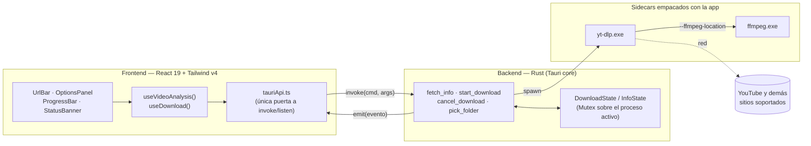
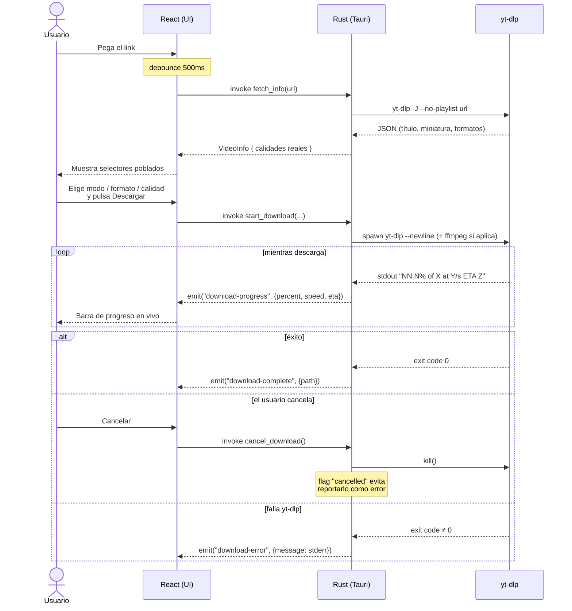

<div align="center">


# Mediagrab

**Pega un link. Elige tu formato. Listo.**

Descargador de audio y video de escritorio para Windows, construido sobre [`yt-dlp`](https://github.com/yt-dlp/yt-dlp) y `ffmpeg`, envuelto en una app nativa con Tauri.

[](https://tauri.app)
[](https://react.dev)
[](https://www.typescriptlang.org)
[](https://www.rust-lang.org)
[](https://tailwindcss.com)

</div>

---

## Qué es

Mediagrab es una interfaz gráfica minimalista sobre `yt-dlp`: pegas un link, la app analiza el video en segundo plano, eliges si quieres el video o solo el audio, en qué formato y calidad, y dónde guardarlo. Una barra de progreso muestra el porcentaje y la velocidad en tiempo real mientras descarga, con opción de cancelar en cualquier momento.

No requiere que el usuario final instale Python, `yt-dlp` ni `ffmpeg` por separado — ambos viajan empacados dentro del instalador como binarios _sidecar_ de Tauri.

## Características

- 🔗 **Pegar y analizar automático** — sin botón de "analizar", solo pegas el link y la app detecta título, miniatura, duración y las calidades reales disponibles para _ese_ video.
- 🎞️ **Video o audio** — MP4/MKV para video, MP3/M4A para audio, con selector de calidad dinámico según lo que el video realmente ofrezca.
- 📂 **Carpeta de destino** elegible con el diálogo nativo del sistema.
- 📊 **Progreso en vivo** — porcentaje, velocidad y ETA, con cancelación real del proceso (no solo de la UI).
- 🖥️ **100% offline-friendly** — tipografías (Geist, Geist Mono, Space Grotesk) auto-alojadas, sin llamadas a CDN externos salvo la propia descarga del contenido.
- 🌓 Interfaz oscura con acabado de vidrio esmerilado, animaciones sutiles y tooltips accesibles.

## Índice

- [Arquitectura](#arquitectura)
- [Flujo de una descarga](#flujo-de-una-descarga)
- [Patrones de diseño](#patrones-de-diseño-del-código)
- [Stack técnico](#stack-técnico)
- [Estructura del proyecto](#estructura-del-proyecto)
- [Cómo correrlo](#cómo-correrlo)
- [Cómo compilarlo](#cómo-compilarlo)
- [Solución de problemas](#solución-de-problemas-comunes)

## Arquitectura

Mediagrab es una app Tauri: el **frontend** (React) solo dibuja UI y despacha _comandos_; todo el trabajo pesado — invocar `yt-dlp`, parsear su salida, mover archivos — vive en el **backend** (Rust), que a su vez delega la descarga real a los binarios _sidecar_.



**Por qué está dividido así:**

- El frontend **nunca** habla con `yt-dlp` directamente — todo pasa por `tauriApi.ts`, así que la superficie de IPC (nombres de comando, forma de los eventos) vive en un único archivo TypeScript.
- El backend mantiene el `CommandChild` del proceso activo en un `Mutex` gestionado por Tauri (`DownloadState`, `InfoState`), lo que permite matarlo desde `cancel_download` o reemplazarlo limpiamente si el usuario pega un link nuevo antes de que termine el análisis anterior.
- `ffmpeg` no se invoca desde React ni se expone como comando: `yt-dlp` lo usa internamente (fusión de audio/video, extracción de audio) vía `--ffmpeg-location`, apuntando a la carpeta del propio ejecutable.

## Flujo de una descarga



## Patrones de diseño del código

| Patrón                                               | Dónde                                                                      | Por qué                                                                                                                                                                               |
| ---------------------------------------------------- | -------------------------------------------------------------------------- | ------------------------------------------------------------------------------------------------------------------------------------------------------------------------------------- |
| **Hooks para lógica, componentes para presentación** | `hooks/useVideoAnalysis.ts`, `hooks/useDownload.ts` vs. `components/*.tsx` | Los componentes (`UrlBar`, `OptionsPanel`, `ProgressBar`, `StatusBanner`) solo reciben props y renderizan — toda la lógica async, debounce y suscripción a eventos vive en los hooks. |
| **Fachada única sobre el IPC**                       | `lib/tauriApi.ts`                                                          | Ningún componente llama `invoke`/`listen` directamente; si cambia un nombre de comando o la forma de un payload, se toca un solo archivo.                                             |
| **Funciones puras para reglas de negocio**           | `lib/formatOptions.ts`                                                     | Derivar formatos/calidades por modo y formatear duración son funciones puras, testeables sin React ni Tauri.                                                                          |
| **Un solo dueño del proceso hijo**                   | `downloader.rs` (`DownloadState`), `info.rs` (`InfoState`)                 | Cada proceso `yt-dlp` activo se guarda en un `Mutex` gestionado; arrancar uno nuevo mata el anterior en vez de dejarlo huérfano.                                                      |
| **Eventos, no polling**                              | `downloader.rs` → `app.emit(...)`, `useDownload.ts` → `listen(...)`        | El progreso se empuja desde Rust hacia React vía eventos de Tauri en lugar de que la UI pregunte por estado.                                                                          |
| **Componentes reutilizables genéricos**              | `components/Tooltip.tsx`                                                   | Un solo componente (`text`, `children`, `position`) reutilizado en cualquier botón, en vez de tooltips ad-hoc repetidos.                                                              |
| **Diseño en tokens, no valores sueltos**             | `src/index.css` (`@theme` de Tailwind v4)                                  | Colores, tipografías y animaciones están declarados una vez como variables de diseño y consumidos por clase utilitaria.                                                               |

## Stack técnico

| Capa                | Tecnología                                                                                        |
| ------------------- | ------------------------------------------------------------------------------------------------- |
| Shell de escritorio | [Tauri 2](https://tauri.app) (Rust + WebView2 en Windows)                                         |
| UI                  | React 19 + TypeScript, Vite                                                                       |
| Estilos             | Tailwind CSS v4 (`@tailwindcss/vite`), tipografías self-hosted (Geist, Geist Mono, Space Grotesk) |
| Iconografía         | [Heroicons](https://heroicons.com)                                                                |
| Motor de descarga   | [`yt-dlp`](https://github.com/yt-dlp/yt-dlp) + `ffmpeg`, como binarios _sidecar_                  |
| Plugins de Tauri    | `shell` (spawnear sidecars), `dialog` (elegir carpeta), `clipboard-manager` (botón Pegar)         |

## Estructura del proyecto

```
Mediagrab/
├─ src/                        # Frontend (React)
│  ├─ components/               # UI de presentación (sin lógica async)
│  │  ├─ UrlBar.tsx
│  │  ├─ OptionsPanel.tsx
│  │  ├─ ProgressBar.tsx
│  │  ├─ StatusBanner.tsx
│  │  └─ Tooltip.tsx
│  ├─ hooks/                    # Lógica async / estado
│  │  ├─ useVideoAnalysis.ts
│  │  └─ useDownload.ts
│  ├─ lib/
│  │  ├─ tauriApi.ts            # Única puerta de entrada al backend
│  │  └─ formatOptions.ts       # Funciones puras (formatos/calidad/duración)
│  ├─ assets/fonts/              # Geist, Geist Mono, Space Grotesk (.woff2)
│  ├─ App.tsx
│  ├─ index.css                 # Tokens de diseño Tailwind v4 (@theme)
│  └─ types.ts                  # Tipos compartidos con el backend
│
├─ src-tauri/                   # Backend (Rust)
│  ├─ src/
│  │  ├─ lib.rs                 # Registro de plugins/comandos, pick_folder
│  │  ├─ info.rs                # fetch_info: análisis del link con yt-dlp -J
│  │  └─ downloader.rs          # start_download / cancel_download
│  ├─ binaries/                 # yt-dlp.exe / ffmpeg.exe (NO versionados, ver abajo)
│  ├─ icons/                    # Íconos generados para cada plataforma
│  ├─ capabilities/default.json # Permisos de los plugins
│  └─ tauri.conf.json
│
└─ app-icon.svg                 # Fuente del ícono (regenerar con `tauri icon`)
```

## Cómo correrlo

### Prerrequisitos

- [Node.js](https://nodejs.org) + [Yarn](https://yarnpkg.com) — **este proyecto usa Yarn**, no mezclar con `npm` (generaría un segundo lockfile).
- [Rust](https://www.rust-lang.org/tools/install) (toolchain estable) + los [prerrequisitos de Tauri para Windows](https://v2.tauri.app/start/prerequisites/) (WebView2, Visual Studio Build Tools con carga de trabajo C++).

### 1. Instalar dependencias

```bash
yarn install
```

### 2. Descargar los binarios de yt-dlp y ffmpeg

`src-tauri/binaries/` está en `.gitignore` (son ~180 MB entre ambos) — hay que traerlos una vez por máquina, tanto para desarrollar como para compilar:

```bash
mkdir -p src-tauri/binaries
cd src-tauri/binaries

# yt-dlp
curl -L -o yt-dlp-x86_64-pc-windows-msvc.exe \
  https://github.com/yt-dlp/yt-dlp/releases/latest/download/yt-dlp.exe

# ffmpeg (build estático de Windows x64)
curl -L -o ffmpeg.zip \
  https://github.com/BtbN/FFmpeg-Builds/releases/download/latest/ffmpeg-master-latest-win64-gpl.zip
unzip -j ffmpeg.zip "ffmpeg-master-latest-win64-gpl/bin/ffmpeg.exe" -d .
mv ffmpeg.exe ffmpeg-x86_64-pc-windows-msvc.exe
rm ffmpeg.zip
```

> El sufijo `-x86_64-pc-windows-msvc` es obligatorio: es la convención de nombres que usa Tauri para resolver binarios _sidecar_ según la plataforma.

### 3. Levantar la app en desarrollo

```bash
yarn tauri dev
```

Esto arranca Vite (hot-reload del frontend) y compila/lanza la ventana nativa. La primera compilación de Rust tarda unos minutos; las siguientes son incrementales.

## Cómo compilarlo

```bash
yarn tauri build
```

**¿El `.exe` final ya trae todo lo necesario para descargar?** Sí. `tauri.conf.json` declara `yt-dlp` y `ffmpeg` como `externalBin`, así que el bundler los copia dentro del instalador (NSIS/MSI) junto con la app — quien instale Mediagrab **no necesita instalar Python, yt-dlp ni ffmpeg por separado**.

Eso sí: los binarios deben existir en `src-tauri/binaries/` en la máquina donde corres el build (paso 2 de arriba) — si clonas el repo en una PC nueva, descárgalos antes de compilar.

## Solución de problemas comunes

<details>
<summary><strong>«Port 1420 is already in use» al correr <code>yarn tauri dev</code></strong></summary>

Quedó un proceso de Vite de una corrida anterior sin cerrar. Ciérralo y vuelve a intentar:

```bash
# Windows
taskkill /F /IM node.exe
taskkill /F /IM mediagrab.exe
```

</details>

<details>
<summary><strong>Cambié <code>app-icon.svg</code> / regeneré los íconos y el <code>.exe</code> sigue mostrando el ícono anterior</strong></summary>

El script de build de Rust (`build.rs`) solo se vuelve a ejecutar si Cargo detecta un cambio en los archivos que vigila (`tauri.conf.json`, principalmente). Si solo tocaste los `.ico`/`.png` sin tocar `tauri.conf.json`, Cargo puede reutilizar el binario ya enlazado con el ícono viejo. Fuerza una recompilación limpia del paquete:

```bash
cd src-tauri
cargo clean -p mediagrab
cargo build
```

</details>

<details>
<summary><strong>Actualicé <code>app-icon.svg</code> — ¿cómo regenero todos los tamaños?</strong></summary>

```bash
yarn tauri icon app-icon.svg
```

Regenera todo `src-tauri/icons/` (incluyendo `icon.ico` para Windows). Recuerda el paso anterior para que el nuevo ícono quede embebido en el `.exe`.
</details>

---

<div align="center">

Hecho con Tauri + React · basado en <a href="https://github.com/yt-dlp/yt-dlp">yt-dlp</a>

</div>
